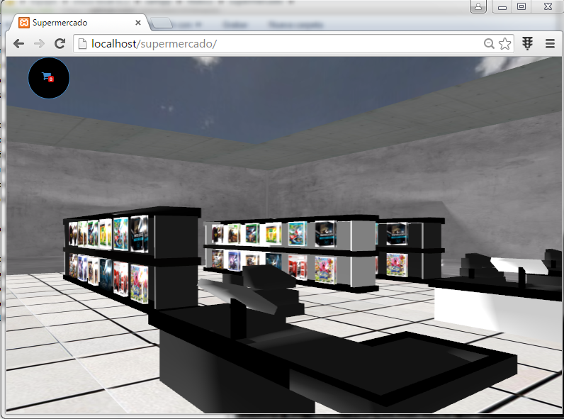
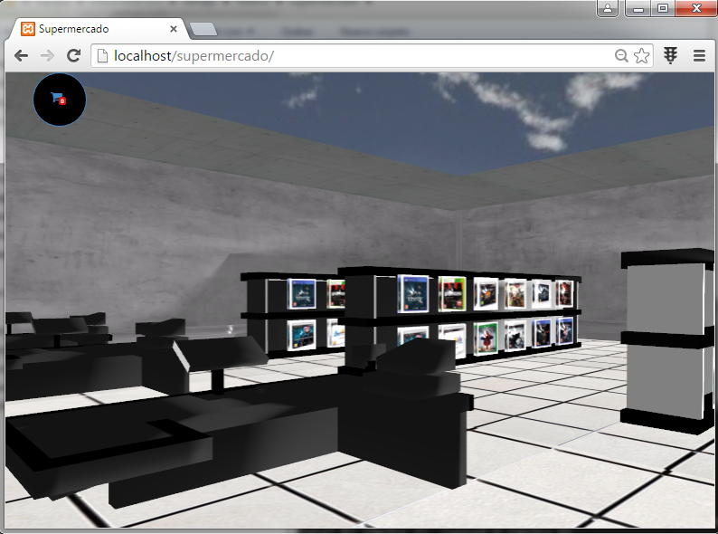

UVShop3d
--------------
UVShop3d es una aplicación web que muestra algunos productos en una tienda virtual 3d

## Bugs
Es probable que encuentres errores durante la ejecución de la aplicación. Escribenos detallando el incoveniente para arreglarlo lo
mas pronto posible.

Capturas
--------------



## Servicios
- Estado de central
- Fotos sobre la congestión en la cafeteria central

## Uso (para desarrolladores)
Descarga el proyecto y colocalo en un servidor web

```
$ git clone ...
```
## Requisitos
- Un navegador web moderno

## Advertencia
- Esta aplicación no compromete a la Universidad del Valle, fue creada por terceros con la motivación de que varios de sus servicios
fuesen expuestos al público a través de nuevas tecnologías.

## Con ❤ desde el lab de redes